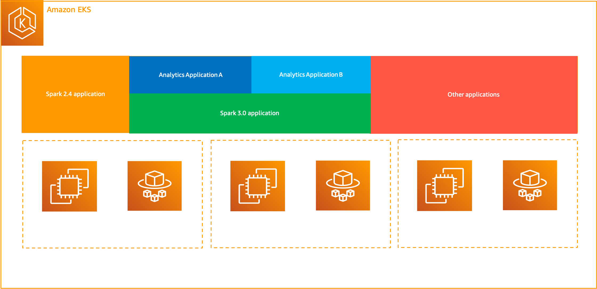
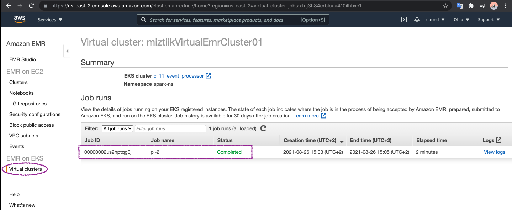

# Kubernetes(EKS) - Big data workflows(EMR) on EKS

The developer at Mystique Unicorn are using big data analytics applications using Apache Spark framework. At the moment they are using AWS EMR for most of their workflows. But they are looking eliminate the heavy lifting of installing and managing their frameworks and integrations with AWS services.

They have been using Kubernetes to orchestrate and manage their containerized applications and benefit from the scalability, portability, extensibility, and speed that Kubernetes offers. They are looking for a way to run EMR workloads on Kubernetes.

Can you show them how the can get started?

## 🎯 Solutions

AWS recently announced Amazon EMR on Amazon EKS, a new deployment option in EMR that allows you to automate the provisioning and management of open-source big data frameworks on EKS. With EMR on EKS, You can now run Spark applications alongside other types of applications on the same EKS cluster to improve resource utilization and simplify infrastructure management.

You get all the same EMR capabilities on EKS that you will get on EC2 today, such as access to the latest frameworks, performance optimized runtimes, EMR Notebooks for application development, and Spark user interface for debugging.

To run jobs on EKS, we need to three components:

- **A Kubernetes Namespace**: It will help us isolate workloads in multi-tenant clusters. It can have either Amazon EC2 or AWS Fargate as the compute provider. This flexibility provides you with different performance and cost options for your jobs to run on.
- **Virtual EMR Cluster**: Registering Amazon EMR with a Kubernetes namespace on Amazon EKS creates a virtual cluster. Amazon EMR can then run analytics workloads on that namespace. When you use Amazon EMR on EKS to submit Spark jobs to the virtual cluster, Amazon EMR on EKS requests the Kubernetes scheduler on Amazon EKS to schedule pods.
- **Job**: A job run is a unit of work, such as a _Spark jar, PySpark script, or SparkSQL query_, that you submit to Amazon EMR on EKS. For each _job_ that you run, Amazon EMR on EKS creates a container with an _Amazon Linux 2 base image_, _Apache Spark_, and associated dependencies. Each job runs in a pod. The pod terminates after the job terminates. Sidecar containers, such as log or metric forwarders, can be deployed to the pod. After the job terminates, you can still debug it using Spark application UI in the Amazon EMR console.

To allow Amazon EMR on EKS access to a specific namespace in the cluster by taking the following actions, We need a Kubernetes role and bind the role to a Kubernetes. This cluster role will be and mapping the Kubernetes user `emr-container` with the service linked role `AWSServiceRoleForAmazonEMRContainers`.



In this blog, I will show you how to setup

- A simple EKS cluster
- A Virtual EMR Cluster on EKS
- Run a sample spark job

1. ## 🧰 Prerequisites

   This demo, instructions, scripts and cloudformation template is designed to be run in `us-east-1`. With few modifications you can try it out in other regions as well(_Not covered here_).

   - 🛠 AWS CLI Installed & Configured - [Get help here](https://youtu.be/TPyyfmQte0U)
   - 🛠 AWS CDK Installed & Configured - [Get help here](https://www.youtube.com/watch?v=MKwxpszw0Rc)
   - 🛠 Python Packages, _Change the below commands to suit your OS, the following is written for amzn linux 2_
     - Python3 - `yum install -y python3`
     - Python Pip - `yum install -y python-pip`
     - Virtualenv - `pip3 install virtualenv`

1. ## ⚙️ Setting up the environment

   - Get the application code

     ```bash
     git clone https://github.com/miztiik/service-mesh-in-eks
     cd service-mesh-in-eks
     ```

1. ## 🚀 Prepare the dev environment to run AWS CDK

   We will use `cdk` to make our deployments easier. Lets go ahead and install the necessary components.

   ```bash
   # You should have npm pre-installed
   # If you DONT have cdk installed
   npm install -g aws-cdk

   # Make sure you in root directory
   python3 -m venv .venv
   source .venv/bin/activate
   pip3 install -r requirements.txt
   ```

   The very first time you deploy an AWS CDK app into an environment _(account/region)_, you’ll need to install a `bootstrap stack`, Otherwise just go ahead and deploy using `cdk deploy`.

   ```bash
   cdk bootstrap
   cdk ls
   # Follow on screen prompts
   ```

   You should see an output of the available stacks,

   ```bash
   eks-cluster-vpc-stack11
   eks-cluster-stack11
   ssm-agent-installer-daemonset-stack11
   emr-artifacts-bkt-stack11
   emr-on-eks-stack11
   ```

1. ## 🚀 Deploying the application

   Let us walk through each of the stacks,

   - **Stack: eks-cluster-vpc-stack11**
     To host our EKS cluster we need a custom VPC. This stack will build a multi-az VPC with the following attributes,

     - **VPC**:
       - 2-AZ Subnets with Public, Private and Isolated Subnets.
       - 1 NAT GW for internet access from private subnets

     Initiate the deployment with the following command,

     ```bash
     cdk deploy eks-cluster-vpc-stack11
     ```

     After successfully deploying the stack, Check the `Outputs` section of the stack for the

   - **Stack: eks-cluster-stack11**
     As we are starting out a new cluster, we will use most default. No logging is configured or any add-ons. The cluster will have the following attributes,

     - The control pane is launched with public access. _i.e_ the cluster can be access without a bastion host
     - `c_admin` IAM role added to _aws-auth_ configMap to administer the cluster from CLI.
     - One **OnDemand** managed EC2 node group created from a launch template
       - It create two `t3.medium` instances running `Amazon Linux 2`.
       - Auto-scaling Group with `2` desired instances.
       - The nodes will have a node role attached to them with `AmazonSSMManagedInstanceCore` permissions
       - Kubernetes label `app:miztiik_on_demand_ng`
       - A cluster user `emr-container` with access to AWS Service Role `AWSServiceRoleForAmazonEMRContainers`

     The EKS cluster will be created in the custom VPC created earlier. Initiate the deployment with the following command,

     ```bash
     cdk deploy eks-cluster-stack11
     ```

     After successfully deploying the stack, Check the `Outputs` section of the stack. You will find the `**ConfigCommand**` that allows yous to interact with your cluster using `kubectl`

   - **Stack: ssm-agent-installer-daemonset-stack11**
     This EKS AMI used in this stack does not include the AWS SSM Agent out of the box. If we ever want to patch or run something remotely on our EKS nodes, this agent is really helpful to automate those tasks. We will deploy a daemonset that will _run exactly once?_ on each node using a cron entry injection that deletes itself after successful execution. If you are interested take a look at the daemonset manifest here `stacks/back_end/eks_cluster_stacks/eks_ssm_daemonset_stack/eks_ssm_daemonset_stack.py`. This is inspired by this AWS guidance.

     Initiate the deployment with the following command,

     ```bash
     cdk deploy ssm-agent-installer-daemonset-stack11
     ```

     After successfully deploying the stack, You can connect to the worker nodes instance using SSM Session Manager.

   - **Stack: emr-artifacts-bkt-stack11**

     This stack will create the s3 bucket to hold our EMR job artifacts. We will add a bucket policy to delegate all access management to be done by access points. _Although not required for this demo, we may use it in the future_.

     Initiate the deployment with the following command,

     ```bash
     cdk deploy emr-artifacts-bkt-stack11
     ```

     After successfully deploying the stack, Check the `Outputs` section of the stack. You will find the `EmrArtifactsBucket`.

   - **Stack: emr-on-eks-stack11**
     This stack creates the following resources to help us run EMR on EKS,

     - EKS Namespace - `spark-ns`
     - Cluster Role `emr-containers` and role binding in namespace `spark-ns`
     - IAM Role for EMR job execution - The permissions _can_ be tightened further. For example scoping it down to a specific bucket
     - EMR Virtual Cluster - `miztiikVirtualEmrCluster01`

     Initiate the deployment with the following command,

     ```bash
     cdk deploy emr-on-eks-stack11
     ```

     After successfully deploying the stack, Take a note of the `EmrVirtualClusterId`, `EmrNamespace` and `EmrExecutionRoleArn`, we will use them later to submit jobs.

1. ## 🔬 Testing the solution

   1. **Run EMR Job on EKS**

      There are many ways of submitting job to your EMR cluster, here we will use the CLI to submit a job using the built-in sample driver.

      You will need the output values from previous stacks and update these variables `VIRTUAL_CLUSTER_ID`, `EMR_EXECUTION_ROLE_ARN` and `s3DemoBucket`

      ```bash
      export VIRTUAL_CLUSTER_ID=$(aws emr-containers list-virtual-clusters --query "virtualClusters[?state=='RUNNING'].id" --output text)
      export EMR_EXECUTION_ROLE_ARN="arn:aws:iam::111122223333:role/emr-on-eks-stack-emr01ExecutionRole12AD66FB08-JQBF4ATJWD5F"

      export s3DemoBucket=s3://emr-artifacts-bkt-stack-databucketd8691f4e-1ge5lqvbumiq2


      aws emr-containers start-job-run \
        --virtual-cluster-id=$VIRTUAL_CLUSTER_ID \
        --name=pi-2 \
        --execution-role-arn=$EMR_EXECUTION_ROLE_ARN \
        --release-label=emr-6.2.0-latest \
        --job-driver='{
          "sparkSubmitJobDriver": {
            "entryPoint": "local:///usr/lib/spark/examples/src/main/python/pi.py",
            "sparkSubmitParameters": "--conf spark.executor.instances=1 --conf spark.executor.memory=2G --conf spark.executor.cores=1 --conf spark.driver.cores=1"
          }
        }'
      ```

      Expected output,

      ```bash
      {
          "id": "00000002us2hptqg0j1",
          "name": "pi-2",
          "arn": "arn:aws:emr-containers:us-east-2:111122223333:/virtualclusters/xfnj3h84crbloua410ilhbxc1/jobruns/00000002us2hptqg0j1",
          "virtualClusterId": "xfnj3h84crbloua410ilhbxc1"
      }
      ```

      Verify all the services have been installed correctly and running,

      ```bash
      kubectl -n istio-system get svc
      ```

      After couple of minutes(as this job is super simple), you check out the logs or EMR dashboard. You will find the job history and the status of the job.

      

1. ## 📒 Conclusion

Here we have demonstrated how to use EMR in EKS. You can extend this by running your EMR job on Fargate or triggering the job through step functions or Apache Airflow.

1. ## 🧹 CleanUp

If you want to destroy all the resources created by the stack, Execute the below command to delete the stack, or _you can delete the stack from console as well_

- Resources created during [Deploying The Application](#-deploying-the-application)
- Delete CloudWatch Lambda LogGroups
- _Any other custom resources, you have created for this demo_

```bash
# Delete from cdk
cdk destroy

# Follow any on-screen prompts

# Delete the CF Stack, If you used cloudformation to deploy the stack.
aws cloudformation delete-stack \
  --stack-name "MiztiikAutomationStack" \
  --region "${AWS_REGION}"
```

This is not an exhaustive list, please carry out other necessary steps as maybe applicable to your needs.

## 📌 Who is using this

This repository aims to show how to setup EMR on EKS to new developers, Solution Architects & Ops Engineers in AWS. Based on that knowledge these Udemy [course #1][102], [course #2][101] helps you build complete architecture in AWS.

### 💡 Help/Suggestions or 🐛 Bugs

Thank you for your interest in contributing to our project. Whether it is a bug report, new feature, correction, or additional documentation or solutions, we greatly value feedback and contributions from our community. [Start here](/issues)

### 👋 Buy me a coffee

[](https://ko-fi.com/Q5Q41QDGK) Buy me a [coffee ☕][900].

### 📚 References

1. [AWS Docs: EMR][1]

### 🏷️ Metadata


**Level**: 200

[1]: https://docs.aws.amazon.com/emr/latest/EMR-on-EKS-DevelopmentGuide/emr-eks.html
[100]: https://www.udemy.com/course/aws-cloud-security/?referralCode=B7F1B6C78B45ADAF77A9
[101]: https://www.udemy.com/course/aws-cloud-security-proactive-way/?referralCode=71DC542AD4481309A441
[102]: https://www.udemy.com/course/aws-cloud-development-kit-from-beginner-to-professional/?referralCode=E15D7FB64E417C547579
[103]: https://www.udemy.com/course/aws-cloudformation-basics?referralCode=93AD3B1530BC871093D6
[899]: https://www.udemy.com/user/n-kumar/
[900]: https://ko-fi.com/miztiik
[901]: https://ko-fi.com/Q5Q41QDGK
